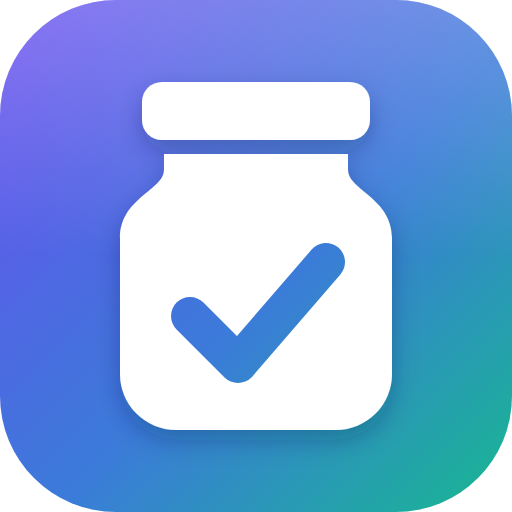

# Pantrix



A self-hosted kitchen planner: recipes, what's in the fridge and pantry, meal plans, and a shopping list that writes itself from the three.

- **Recipes and ingredients.** Recipes scale by servings. An ingredient line can accept substitutes ("penne or elbow pasta"), and an ingredient can record the exact product you usually buy.
- **Inventory.** What you have in the refrigerator, freezer and pantry, with expiry dates and a "keep at least" amount per ingredient.
- **Meal plans.** Put a recipe, a single ingredient (a packaged meal), or "eating out" on each day, and close out days as you finish planning them.
- **A live shopping list.** Always current: what upcoming meals need, plus anything below its minimum, less what's in inventory. Add your own items too.
- **Stores and aisles.** Record which aisle each item is in at each store you use, and the list sorts into walking order for the store you're in. Each item can link to its page on the store's website.

## Accounts and kitchens

Pantrix is behind a username and password. The first time you open a fresh install it asks you to create an account,
and that account is the admin.

- **Each account has its own kitchen.** Recipes, ingredients, inventory, meal plans, shopping lists and stores all
  belong to a kitchen, and nobody outside it can see them.
- **Sharing a kitchen.** A kitchen's owner finds a join code on the Kitchen page. Anyone with an account who enters
  it joins that kitchen and can see and change everything in it. They can go back to their own kitchen at any time,
  and the owner can remove them or change the code.
- **Sign-ups.** Anyone who can reach the sign-in page can create an account until the admin switches that off on the
  Admin page. Do so once everyone has an account, especially if Pantrix is reachable from the internet. The admin can
  see who has an account, but not into their kitchens.

Upgrading from a version without kitchens keeps everything: the existing data becomes the first account's kitchen.

## Unraid

Install **Pantrix** from Community Applications, or add the template by hand from
[`007darkmatter5/unraid-templates`](https://github.com/007darkmatter5/unraid-templates/blob/main/templates/pantrix.xml).

The template maps two folders. Back them up together:

| Container path | Default on Unraid | Holds |
| --- | --- | --- |
| `/data` | `/mnt/user/appdata/pantrix/data` | The database, `pantrix.db` |
| `/keys` | `/mnt/user/appdata/pantrix/keys` | The keys that encrypt sign-in cookies |

To reach Pantrix from outside your network, put it behind a reverse proxy that handles HTTPS and set
**Behind a reverse proxy** to `true`.

## Docker

```bash
docker run -d --name pantrix \
  -p 8080:8080 \
  -v /path/to/data:/data \
  -v /path/to/keys:/keys \
  -e PUID=1000 -e PGID=1000 \
  ghcr.io/007darkmatter5/pantrix:production
```

Then open `http://<host>:8080` and create your account.

| Tag | Built from | For |
| --- | --- | --- |
| `production`, `latest`, `<version>` | `main` | Everyday use |
| `beta`, `<version>-beta` | `beta` | Trying changes before they reach `main` |

| Variable | Default | Meaning |
| --- | --- | --- |
| `PUID` / `PGID` | `1654` | The user and group Pantrix runs as and that own `/data` and `/keys` (Unraid: `99` / `100`) |
| `ASPNETCORE_FORWARDEDHEADERS_ENABLED` | `false` | Set to `true` behind a reverse proxy that handles HTTPS |

`/healthz` answers without signing in, for health checks.

## Aisle lookups (optional)

Every store works with aisles you type in. For stores that show aisles on their website, Pantrix can also look them
up, by driving a real Chrome browser that you run next to it. Store sites turn away plain programs, so a real browser
on your own network is the only thing they serve. The Stores page lists which chains are known to work; H-E-B is the
one tested so far, and Sam's Club is manual because its website doesn't show aisles at all.

Lookups happen only when someone presses **Look up**, one page at a time. If a site asks for a human check, Pantrix
says so and you complete it in the browser yourself; it doesn't try to get past it. Automated use may be against a
store's terms, and a site can change or block it at any time, so treat this as a convenience, not a guarantee.

A browser container for Unraid (Compose Manager) or any Docker host. It shares a private Docker network with Pantrix,
so the port that controls the browser is reachable by Pantrix and nothing else:

```bash
docker network create pantrix
```

```yaml
services:
  pantrix-browser:
    image: lscr.io/linuxserver/chromium:latest
    container_name: pantrix-browser
    restart: unless-stopped
    shm_size: "1gb"
    security_opt:
      - seccomp:unconfined
    environment:
      PUID: "99"
      PGID: "100"
      CHROME_CLI: "--remote-debugging-port=9222"
      # A sign-in for the browser's screen. Set both; the browser may be signed in to your store accounts.
      CUSTOM_USER: "choose-a-username"
      PASSWORD: "choose-a-password"
    ports:
      - "3011:3001"   # the browser's screen (https)
    networks:
      - pantrix
    volumes:
      - /mnt/user/appdata/pantrix-browser:/config

  # Chrome only listens for remote control on its own loopback address; this passes the port on, inside the
  # private network only. It is deliberately not listed under "ports".
  pantrix-browser-port:
    image: alpine/socat
    container_name: pantrix-browser-port
    restart: unless-stopped
    network_mode: "service:pantrix-browser"
    command: TCP-LISTEN:9223,fork,reuseaddr TCP:127.0.0.1:9222

networks:
  pantrix:
    external: true
```

1. Put Pantrix on the same network: in its Unraid template set **Network Type** to `pantrix` (or add
   `networks: [pantrix]` to its Compose service).
2. Open `https://<host>:3011`, go to each store's website in that browser, and choose your store location.
3. In Pantrix, on the Admin page, enter `http://pantrix-browser:9223` as the browser address and press Test.
4. Give a store the **Browser lookup** method (H-E-B gets it automatically). **Look up** then appears on the Stores
   page and in the ingredient dialog.

### Signing in to store accounts

You can sign in to a store's website in that browser, and it stays signed in: the session lives in the browser's own
profile (`/config`), so lookups then run as you, with your account's store already selected. Pantrix never sees or
stores the password, and doesn't fill in sign-in forms.

A signed-in browser is worth protecting. Whoever can control it can act as you on those sites, which may include
placing an order. That is why the control port above isn't published to your network and the browser's screen has its
own sign-in. Automated use is also then tied to your account, not just your internet address.

## Address lookup

When you look up a store's address, what you typed is sent to [OpenStreetMap](https://www.openstreetmap.org/copyright)'s
Nominatim service, and to [Photon](https://photon.komoot.io) if that finds nothing. Nothing else leaves your server.

## Development

Requires the .NET 10 SDK.

```powershell
dotnet run --project src/Pantrix     # http://localhost:5057
dotnet test
dotnet ef migrations add <Name> --project src/Pantrix
```

The database is created on first run (`src/Pantrix/pantrix.db`) and migrations apply on startup. Point the app at a
throwaway database with `ConnectionStrings__Pantrix="Data Source=<path>"`.

Day-to-day work happens on `beta`; merging `beta` into `main` releases to Production. Every push to either branch
runs the tests, builds the image for amd64 and arm64, starts it the ways it is deployed, and only then publishes it.

## License

[MIT](LICENSE)
